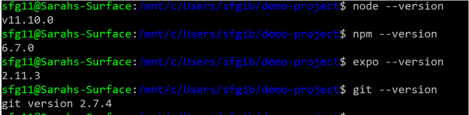
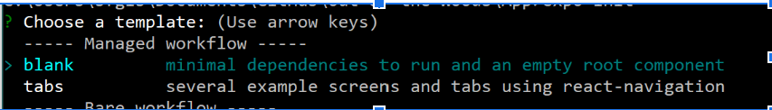
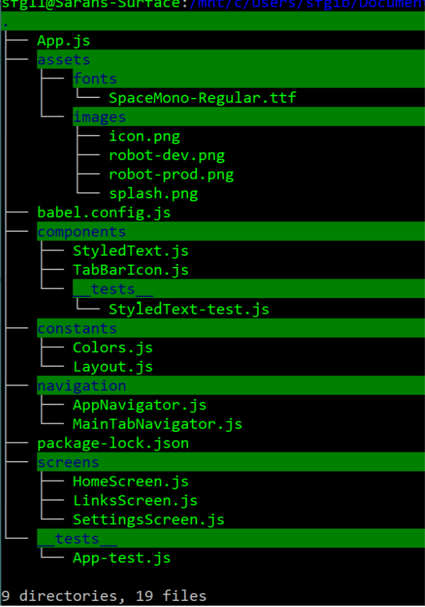

# foo-app readme

## What is React Native?
  __React Native is a Javascript framework used for building iOS and Android mobile apps.__

Under the hood React Native “bridge” invokes native rendering APIs in Objective-C (iOS) or Java (for Android)... aka the application we build will render using real mobile UI components, not webviews, aka will look and feel like any other mobile application we use..
React Native apps can access platform features like the phone camera or the *user’s location* :]

_Many famous apps use React Native, a few to name drop:_
  - Facebook (created it so duh)
  - Walmart
  - Instagram
  - Discord
  - Soundcloud
  - Wix and more

# How is React Native different than React JS?

In short, ReactJS is for web development and React Native for hybrid app development (iOS and Android)

ReactJS is a JavaScript library for creating user-interface for large web applications. Created by facebook and known for being especially good for large dynamic web pages that process data in real-time and can display the changes without needing to reload- like the Facebook/Instagram feed

React Native, on the other hand, is a framework consisting of native libraries for creating mobile applications. The libraries (also created by facebook) can be used to develop applications for all platforms because the React Native code compiles into native mobile app components.
# Why React Native?
React Native is an exciting framework that enables developers to create __robust mobile applications__ using some prior JavaScript knowledge. It offers __faster mobile development__, and more __efficient code sharing__ across __iOS, Android, and the Web__, without sacrificing the __end user's experience or application quality__.

All about code reusability + having the best mobile UI experience possible
### What is Expo?
[Expo] (https://docs.expo.io/versions/latest/) is a __toolchain__ built around __React Native__ to help you quickly start an app. It provides a set of tools that simplify the development and testing of React Native app as well as well as doesnt require having to use a __platform specific development environment__ i.e. Xcode  on Macs or Android Studio on Windows.
Projects created with the Create React Native App tool are Expo projects.
### Why Expo?
Expo makes it very easy to develop on your physical device and removes many of the initial roadblocks to getting started with React Native.
You can read more about Expo and install the Expo mobile app at https://docs.expo.io/versions/latest/
#### Development Environment Setup + React Native (using Expo) on WSL (but should pretty much work the same on Mac and Linux)

I followed this: [https://facebook.github.io/react-native/docs/getting-started.html] and [expo.io]
Before proceeding I highly recommend to make sure everything was installed properly:

`$ npm install -g expo-cli`
`$ expo init demo-project`

##### Chose tabs! 

__Note__: while its creating the project, go ahead and open up the file explorer and navigate to where the project is, here you can see it created the project folder has downloaded a ton of resource in this thing… the biggest thing here is the __node_modules__ folder which has tens maybe hundreds of different react native packages which contain utilities and components that make react native so nice to use.
### On your machine:

From here make sure you’re in the right folder you want to create your project in and then run the command:
`$ cd demo-project`
`$ expo start`

This is going to kick open a browser (default: http://localhost:19002) and open the GUI tool for EXPO, which will begin building the application.

__Metro Bundler__ is packaging up your code into a nice package that can actually be executed on your (either on your phone or an emulator)

At this point you can scan the QR code on your phone and launch the expo app and you’ll see a screen or you can research and look into how to go about using an emulator.

This  video walks the user through setting up a development environment for React Native using Expo and walks through Installing an Android emulator (Gennymotion)

### On your phone:
#### Running your development app on real-world devices

- Open the App Store on your iPhone, or the Google Play Store on your Android device. Search for and download the Expo Client app.
- While your app is running on your development machine, you should also have the Expo Developer Tools open in a browser.
- You should see a QR code at the bottom of the left-hand side menu of the Expo Developer Tools.
- Use the iPhone's native Camera app, or the Scan QR Code button in the Expo Client app on Android, to scan the QR code.
- This will open your in-development app on the device within the Expo Client app.

Viola, the app is now running on your real device, fully equipped with live reload! (Hot Reloading should be default but if youre making changes to App.js and dont see anything happening on your screen then dm me. You can also shake the device to toggle between your React Native app and the Expo Developer menu)

### File Structure
Skeleton of the app should look like this:

### Node Modules
Note that you should have a node_modules folder (I pushed everything except that because as donald trump would say, its yuuuuuuugeeeee and i got tired of waiting)....
__How it feels when you open the node_modules folder → ___

#### Sources: 
- [Expo documentation] (https://docs.expo.io/versions/latest/)
- [React Native Cookbook - Second Edition by Dan Ward](https://www.oreilly.com/library/view/react-native-cookbook/9781788991926/32882bd3-85bb-4947-87aa-9f8fed6658c4.xhtml)
- 
